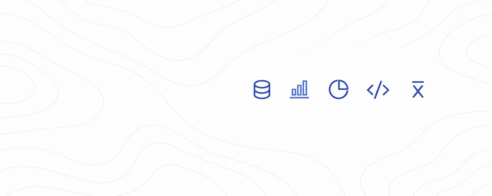

# Pezhman Aliabadi — Connecting the Dots

> Everything is and can be connected; it is up to us to find the pattern.

I'm a data analyst and BI developer exploring ideas through data, code, and curiosity. This is a collection of practical lessons, experiments, and small tools from that work.

🌐 [Visit pejhan.ir](https://pejhan.ir)

## 📝 Blog

- **[Finding order where there seem to be None](https://www.linkedin.com/pulse/finding-order-where-seem-none-pezhman-aliabadi-gkqif)** — Use foreign-key relationships and recursive SQL to find the order for migrating data between related tables.
- **[Six months with PostgreSQL, after years of SQL Server](https://www.linkedin.com/feed/update/urn:li:activity:7359684286637051905/)** — Observations on working with PostgreSQL after years in the SQL Server ecosystem, with a short comparison video.
- **[Asterisk Risk ✨: Avoid using `*` in your SQL code](https://www.linkedin.com/pulse/asterisk-risk-avoid-using-you-sql-code-pezhman-aliabadi-kkggf)** — How schema changes can quietly break SQL Server views using `SELECT *`, and how explicit columns and schema binding help.

## 🛠️ Side projects

- **[Trash Current Track](https://github.com/Pejhan/quodlibet-trash-current)** — A Quod Libet plugin that confirms before moving the current track to the trash and removing it from the library.
- **[Playlist Shortcuts](https://github.com/Pejhan/quodlibet-playlist-shortcuts)** — Add the current Quod Libet track to playlists with global keyboard shortcuts, without duplicates.
- **[Grabgram](https://github.com/Pejhan/Grabgram)** — A desktop app for downloading Telegram videos, audio, photos, and documents, with resumable downloads and download history.

## 👋 About & contact

Often working with SQL, Python, statistics, Power BI, and data modeling. Still learning how to ask better questions, explain results, and document what worked.

[GitHub](https://github.com/pejhan) · [LinkedIn](https://www.linkedin.com/in/pejhan) · [Telegram](https://t.me/pejhan)
